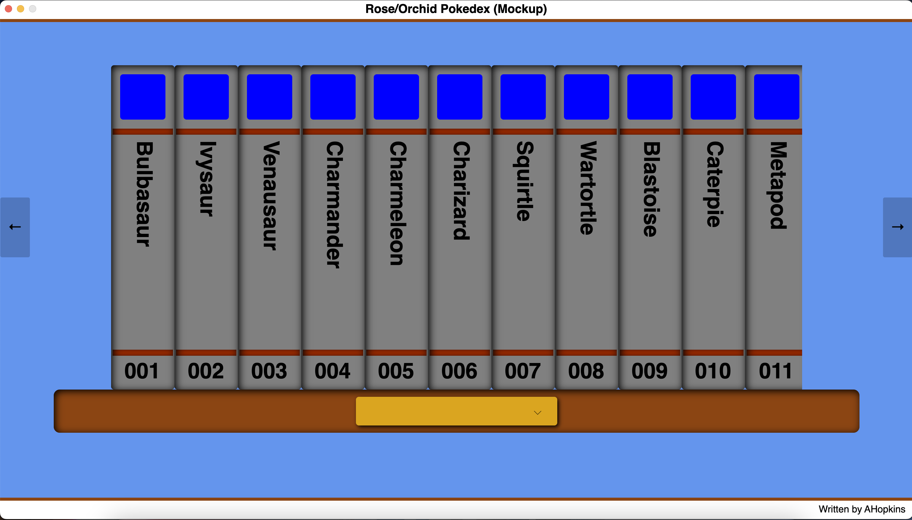

# Orchid
Orchid is a Pokédex application similar to a bookshelf with a set of encyclopedias.

## Scarlet and Violet
Orchid is a pokédex application based on the pokédex found in the mainline Pokémon games, Scarlet and Violet.
The Scarlet/Violet pokédex consists of a bookshelf where each volume is a separate pokemon found in the game.
Selecting a volume opens up a screen showcasing the pokemon's flavor text, typing, and height/weight stats.
Clicking on the '+' button while the screen is open shows a detailed, in-game map of the pokémon's location.
Moving D-Pad up and down changes the Pokémon's form, if it has multiple forms (and if a shiny version has
been caught).

## Rose and Orchid
Orchid won't have the location feature, but will showcase pokémon as volumes on a bookshelf. Clicking on
a book will open a book-like screen, where the user will be able to flip through pages that describe
a pokémon such as typing, breeding, move sets, flavor texts, etc.  The user will be able to change pokédexes
by selecting a regional pokédex from the drop down 'name plate'.



# Development
I am developing Orchid using the following hardware and tools.

## Hardware
I am developing Orchid on a Macbook Pro with an M3 chip.  The Macbook has the following specs:
```
    Model Name: MacBook Pro
    Model Identifier: Mac15,3
    Model Number: MTL73LL/A
    Chip: Apple M3
    Total Number of Cores: 8 (4 performance and 4 efficiency)
    Memory: 8 GB
    OS: macOS Sequoia, version 15.3.2.
```

## Runtimes
Being a C# developer, I am using .NET 9.0.  Typing (in the terminal) the following: .NET --info yields the following
information:
```    
    .NET SDK:
        Version:           9.0.200
        Commit:            90e8b202f2
        Workload version:  9.0.200-manifests.c4f6226a
        MSBuild version:   17.13.8+cbc39bea8

    Runtime Environment:
        OS Name:     Mac OS X
        OS Version:  15.3
        OS Platform: Darwin
        RID:         osx-arm64
        Base Path:   /usr/local/share/dotnet/sdk/9.0.200/

    .NET workloads installed:
        [macos]
        Installation Source: SDK 9.0.200
        Manifest Version:    15.2.9173/9.0.100
        Manifest Path:       /usr/local/share/dotnet/sdk-manifests/9.0.100/microsoft.net.sdk.macos/15.2.9173/WorkloadManifest.json
        Install Type:        FileBased
```

## IDEs
I am using Jetbrain's Rider IDE to write and test the application.  At the time of this writing, Rider is free for use, 
simply download it from Jetbrain's website.
```
JetBrains Rider 2024.3.6
Build #RD-243.25659.34, built on February 26, 2025
Runtime version: 21.0.6+8-b631.39 aarch64 (JCEF 122.1.9)
```

# Building
The easiest way to build Orchid is to start Rider, open the solution, and select 'Rebuild Solution' from the Build menu.
The second way is to open a terminal, navigate to the solution directory, and enter: dotnet build

(TODO Expand the build instructions)

# Running
(TODO Expand the run instructions)
